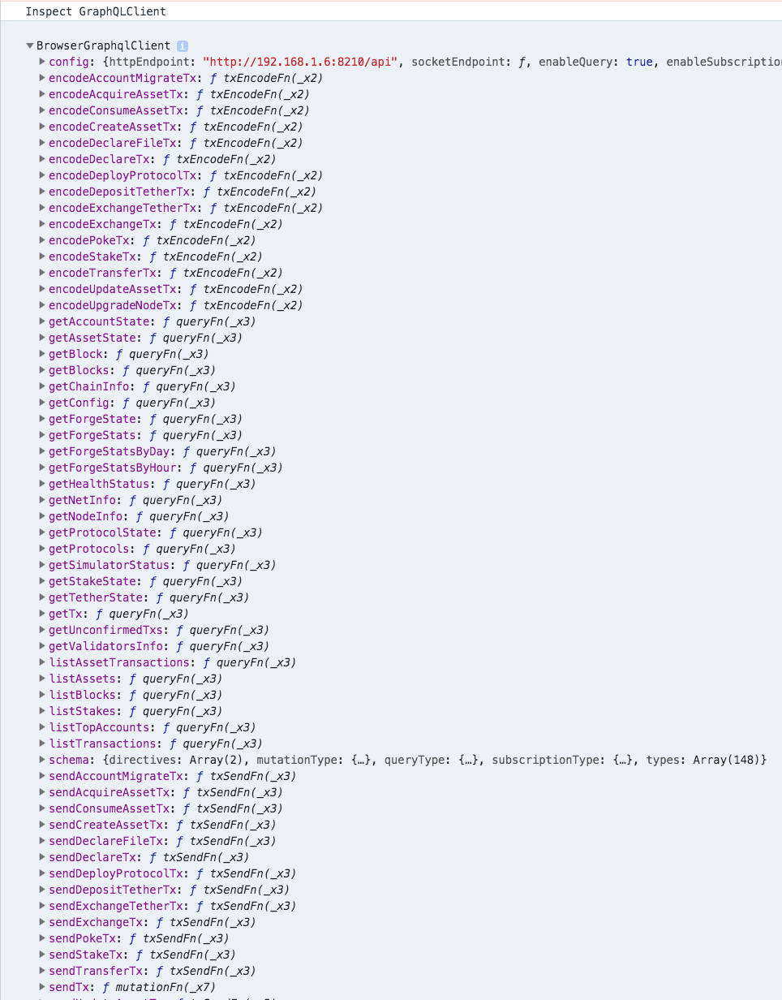

## Introduction

[](https://www.npmjs.com/package/forge-python-starter)
[](https://docs.arcblock.io/forge/sdks/python/latest/)
[](https://travis-ci.com/arcblock/forge-python-starter)
[](https://gitter.im/ArcBlock/community?utm_source=badge&utm_medium=badge&utm_campaign=pr-badge)

- [Introduction](#introduction)
- [Runtime Requirements](#runtime-requirements)
- [Usage](#usage)
  * [Setup a chain (optional)](#setup-a-chain--optional-)
  * [Create new project with forge-cli](#create-new-project-with-forge-cli)
  * [Just use this starter repo](#just-use-this-starter-repo)
- [Configuration](#configuration)
- [FAQ](#faq)
  * [What APIs are supported by `GraphQLClient`?](#what-apis-are-supported-by--graphqlclient--)
- [LICENSE](#license)

> Brings tons of thousands react libraries/components to dApps that run on [forge](https://www.arcblock.io/en/forge-sdk) powered blockchain.

Python starter project that integrates [Forge SDK](https://docs.arcblock.io/forge/latest/), [Python SDK](https://docs.arcblock.io/forge/latest/sdk/python.html) with mainstream javascript application batteries:

Forge JavaScript SDK libraries included in the starter project:

- [@arcblock/forge-wallet](https://www.npmjs.com/package/@arcblock/forge-wallet) Utility function to create and use a forge compatible wallet, the wallet is also DID compatible.
- [@arcblock/graphql-client](https://www.npmjs.com/package/@arcblock/graphql-client) Client library to connect your app with forge powered blockchain node, all requests are sent over http/https, can be used in both Node.js and browser environment.
- [@arcblock/mcrypto](https://www.npmjs.com/package/@arcblock/mcrypto) Forge mcrypto implementation for javascript, just a wrapper around existing javascript crypto libraries.
- [@arcblock/react-forge](https://www.npmjs.com/package/@arcblock/react-forge) UI components that can be used in React Applications built on top of forge powered blockchain.

Forge Python SDK libraries included in the starter project:

- [Forge Python SDK](https://docs.arcblock.io/forge/sdks/python/latest/)

## Runtime Requirements

- Python >=3.x && <=3.6
- Node.js v10+
- Mongodb v3+

## Usage

### Setup a chain (optional)

``` bash
npm install -g @arcblock/forge-cli
forge install
forge start
```

### Create new project with forge-cli

``` bash
forge blocklet:use forge-python-starter

# prepare env
make create-env && yarn install

# start server
make run-server

# start front-end
yarn start
```

### Just use this starter repo

> **Note: You have to setup an `.env` file manually.**

```terminal
git clone https://github.com/ArcBlock/forge-python-starter.git
cd forge-python-starter/templates

# prepare env
make create-env && yarn install

# start server
make run-server

# start front-end
yarn start
```

## Configuration

dApp configuration file is auto generated and stored in `.env`, example configure as:

```text
# server only
MONGO_URI="mongodb://localhost/forge-python-starter"
APP_TOKEN_SECRET="you_should_change_this"
APP_TOKEN_TTL="1d"
APP_SK="0x12433d2ffae0e304c04504c45c19d8b7d7825ef017c48811a784b35bf7ba26cfecf4ec97e4cf2d5a62a93bf16eb841b0faa1980c86a24cc2db6f218d410aee32"
APP_PORT=8000

# both server and client
REACT_APP_CHAIN_ID="zinc-2019-05-17"
REACT_APP_CHAIN_HOST="https://zinc.abtnetwork.io/api"
REACT_APP_APP_ID="zNKdL4LTzmiMDenTBtCixngRqGBk6YtZLseM"
REACT_APP_APP_NAME="Forge React Starter"
REACT_APP_BASE_URL="http://10.113.10.82:8000"
REACT_APP_API_PREFIX=""
```

> Caution: `.env` contains very sensitive info such as Application wallet secret key, PLEASE DO NOT COMMIT `.env` FILE

## FAQ

### What APIs are supported by `GraphQLClient`?

Checkout the following screenshot or just run the starter and open browser console.



## LICENSE

Copyright 2018-2019 ArcBlock

Licensed under the Apache License, Version 2.0 (the "License");
you may not use this file except in compliance with the License.
You may obtain a copy of the License at

    http://www.apache.org/licenses/LICENSE-2.0

Unless required by applicable law or agreed to in writing, software
distributed under the License is distributed on an "AS IS" BASIS,
WITHOUT WARRANTIES OR CONDITIONS OF ANY KIND, either express or implied.
See the License for the specific language governing permissions and
limitations under the License.
